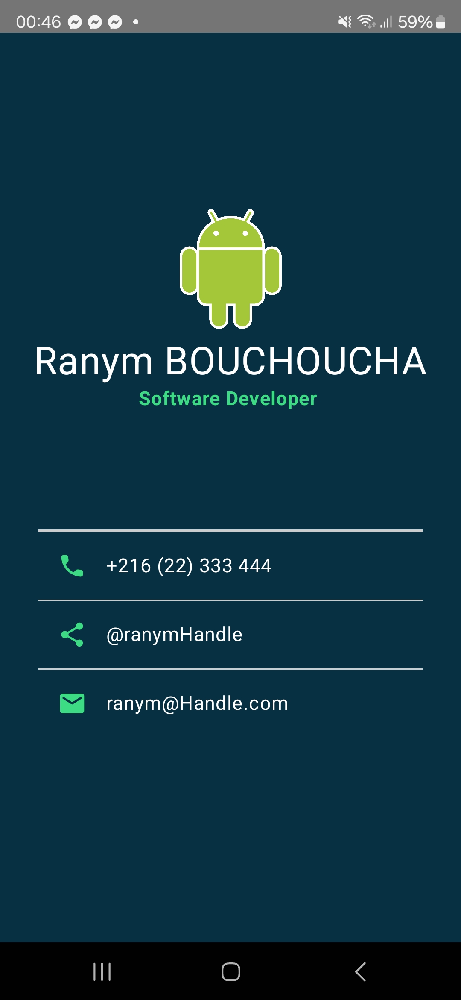

# Business Card App

A simple Android application that displays a digital business card built with Jetpack Compose.

## Project Overview

This app was created following the [Android Basics with Compose: Business Card App Codelab](https://developer.android.com/codelabs/basic-android-kotlin-compose-business-card?hl=en). It demonstrates the use of Jetpack Compose to create a clean, modern UI for a personal business card.

## Features

- Clean business card layout with Jetpack Compose
- Display of personal information including:
  - Name and title
  - Profile picture/logo
  - Contact information (phone, email, social media)
- Material Design implementation
- Dark theme with custom color palette

## Screenshots

## Technologies Used

- Kotlin programming language
- Jetpack Compose for UI
- Material 3 Design components
- Android Studio

## Setup & Installation

1. Clone this repository
2. Open the project in Android Studio Arctic Fox (2020.3.1) or newer
3. Build the project and run it on an emulator or physical device

## Requirements

- Android Studio Arctic Fox or newer
- Minimum SDK: API 21 (Android 5.0)
- Target SDK: API 33 (Android 13)

## What I Learned

- Basic Jetpack Compose UI building
- Working with Column and Row layouts
- Adding and styling text elements
- Incorporating images and icons
- Managing spacing and alignment
- Implementing Material Design principles
- Using custom colors and themes

